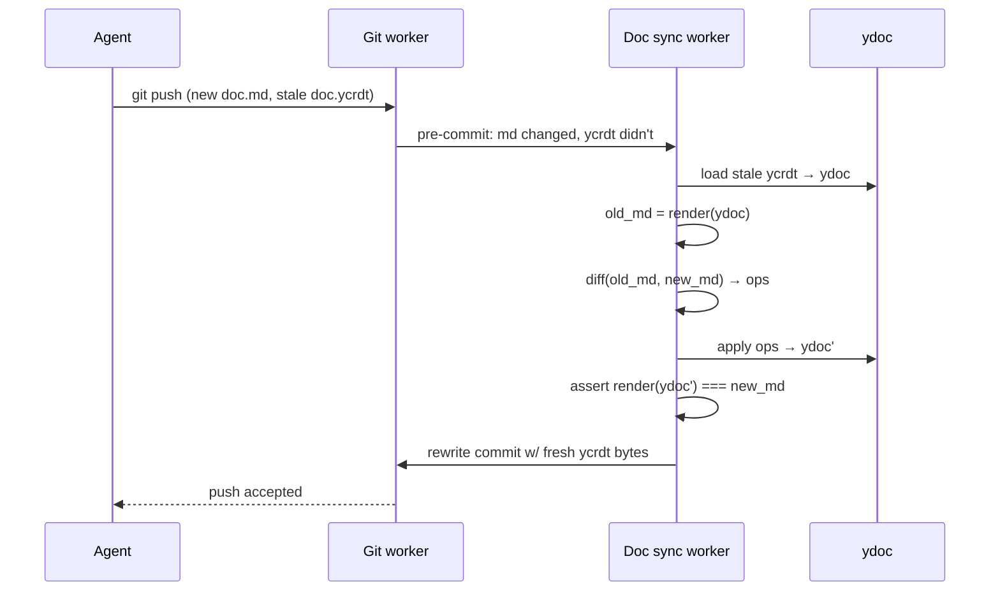

# sheaf — design doc v0.1

*a documentation-first ide for the ai era. storage substrate: cloudflare artifacts (git). editing substrate: yjs crdts. comments: first-class, versioned, cross-cutting. users never see `git merge`.*

> sheaf *(n.)* — algebraic-geometry term for locally-defined data glued into a globally coherent object. apt, bc every workspace is locally authored but the org's knowledge graph is the glued whole.

---

## 1. thesis

docs are the primary artifact of software work; code is a compile target. the tools we use to coordinate on docs treat them as either (a) versioned-but-inert text files in git, or (b) multiplayer-but-ephemeral blobs in notion. neither treats docs as what they actually are: long-lived, forkable, commentable, agent-editable specifications.

sheaf is the substrate for treating them that way.

scope of this doc: storage model + md↔ycrdt sync algorithm + comment anchoring + draft model + mcp surface. out of scope: editor rendering, auth, billing, infra topology beyond what sync requires.

---

## 2. storage model

**one repo per org**, folders per workspace. single ref namespace means cross-cutting proposals are trivially a branch touching multiple folders.

```
.sheaf/
  config.yml              # org-level config
  thread-index.yml        # derived: target_path -> [{thread_id, home_dir}]
  threads-archive/        # orphaned threads (last target deleted)
workspaces/
  infra/
    docs/
      proposal.md         # canonical rendered markdown
      proposal.ycrdt      # yjs state snapshot (binary)
      proposal.threads/   # sidecar: threads whose HOME is this doc
        thrd_9fe2.yml
        thrd_a1b3.yml
      adr-012.md
      adr-012.ycrdt
      adr-012.threads/
        thrd_c5d6.yml
  product/
    docs/
      q3-roadmap.md
      q3-roadmap.ycrdt
      q3-roadmap.threads/
        thrd_e7f8.yml
```

every doc is self-contained: `<name>.md` + `<name>.ycrdt` + `<name>.threads/`. listing the doc's parent dir surfaces everything relevant to that doc.

- `.md` = canonical rendered markdown. what humans read, what agents grep, what diff viewers render.
- `.ycrdt` = yjs state snapshot (binary). **the merge-truth.** source of authority for concurrent-edit semantics.
- `.threads/` = sidecar dir holding threads whose *home* is this doc (created here, or migrated here after a cascade).

**cross-cutting threads** live in exactly one sidecar (their home) but list multiple targets in their yaml. the derived index at `.sheaf/thread-index.yml` maps foreign target paths → home locations, so resolving "all threads on doc X" is two reads (home sidecar + index lookup). index entries exist only for threads with >1 target; single-target threads don't need indexing.

**cascade rules:**
- doc deleted w/ home threads → move threads to next remaining target's sidecar. no remaining targets → `.sheaf/threads-archive/`. never silently delete.
- doc renamed → sidecar renamed with it (git sees as rename; blame preserved). cross-refs in thread files mentioning the old path get rewritten in the same commit. index updated.
- misplaced thread file → worker tree-walks and reconciles on next pass; anomaly logged.

**invariant 1 (consistency at rest):** at every commit on every branch, `render(doc.ycrdt) === doc.md`. no exceptions.

**invariant 1.5 (thread locality):** every thread file lives in exactly one sidecar dir corresponding to one of its targets. the index is fully derivable from a tree walk.

---

## 3. invariants

1. **consistency at rest** — render(ycrdt) === md at every committed state
2. **crdt merge commutes** — two branches merge via yjs update-merge; result is deterministic regardless of op order
3. **anchor survival** — comment anchors (yjs relative positions) survive any edit to the underlying ytext, provided the ycrdt history is intact
4. **no silent annihilation** — if a ycrdt is reconstructed from md (history lost), anchors fall back to content-based fuzzy matching; orphans surface in ui, never vanish

---

## 4. the md ↔ ycrdt sync algorithm

four cases. three boring, one genuinely hard.

### 4.1 case 1 — crdt edit (web editor)

easy path.

1. user types in web editor → yjs op generated in the doc's Durable Object → applied to in-memory ydoc → broadcast to connected clients via websocket
2. at commit point (user hits "keep draft", or idle-timeout fires): serialize ydoc to bytes → stage `doc.ycrdt`; render ydoc → stage `doc.md`; one git commit, both files

no sync work needed; the two representations are produced atomically from one source.

### 4.2 case 2 — md edit (agent pushes via git)

the interesting path. agent clones a branch via `artifact-fs` or plain `git clone`, edits `doc.md` in whatever tool it wants, doesn't touch `doc.ycrdt`, `git push`.

sheaf's git worker sees: md changed, ycrdt unchanged. cannot accept as-is (invariant 1 broken). must reconcile before the push completes.



algorithm detail:

1. load current `doc.ycrdt` into a fresh ydoc
2. `old_md = render(ydoc)`
3. compute char-level diff(`old_md`, `pushed_md`) — myers, patience, or histogram; v0 uses myers
4. translate each diff hunk into a yjs text op against the ydoc:
   - hunk "delete chars [a, b)" → `ytext.delete(a, b - a)`
   - hunk "insert string s at a" → `ytext.insert(a, s)`
5. apply ops → new ydoc
6. **verify**: `render(new_ydoc) === pushed_md`. if not equal, bail w/ an error surfaced to the pusher; do not accept the commit
7. serialize new ydoc → `doc.ycrdt` bytes. rewrite the commit to include the updated ycrdt alongside the md change. accept push.

why this preserves anchors: yjs relative positions are tuples of (left-origin-op-id, right-origin-op-id) pointing into the ycrdt's internal op graph. inserts and deletes in unchanged regions don't touch the origin-ids that bracket anchors in other regions — anchors stay pinned to the same logical text. anchors inside a deleted hunk are tombstoned (still resolvable) and get resolved via content-fallback on read (§5).

cost: md rendering + diff + op translation on every git push. cheap (<100ms for docs <1mb); runs in a worker. cache state vectors per branch so repeat pushes on the same branch don't re-serialize.

### 4.3 case 3 — concurrent edits across branches

user edits `proposal.md` in the web editor on branch `draft-alice`. in parallel, an agent pushes a refactor to branch `exp-refactor`. user asks to combine them.

both branches have valid `doc.ycrdt` files that share common yjs history at the fork point. merging is a yjs operation, not a git one:

1. load both ycrdts → `ydoc_A`, `ydoc_B`
2. compute the update diff: `update = Y.encodeStateAsUpdate(ydoc_B, Y.encodeStateVector(ydoc_A))`
3. `Y.applyUpdate(ydoc_A, update)` → merged ydoc. commutative, associative, conflict-free by construction
4. render merged ydoc → merged md
5. commit `{merged ycrdt, merged md}` onto target branch

user sees a rendered-markdown diff of merged vs. pre-merge draft. same review ux as a pr. the word "merge" never surfaces; button says **accept** or **combine**.

edge case — concurrent semantic conflict: agent rewrites a paragraph alice simultaneously deleted. crdt merge semantics say both ops apply; alice's delete tombstones the old text, agent's edits land but reference tombstoned content. render produces a consistent-but-weird output. **this is a ui problem, not a correctness problem.** reviewer sees the diff, sees something is off, decides. no conflict markers, no data loss.

### 4.4 case 4 — ycrdt loss / corruption

`doc.ycrdt` deleted, truncated, or fails to deserialize. recovery:

1. rebuild ydoc from `doc.md`: fresh client id, single insert of the full md text. history starts from zero.
2. all existing threads targeting this doc have invalid `rel_pos`. on next read, each falls back to content-anchor resolution (§5).
3. log the event; ui shows "version history reset at <commit>" on the doc's history panel.

this is the worst-case fallback. mitigations:
- pre-commit validation that ycrdt deserializes cleanly before accepting a push
- out-of-band ycrdt snapshot backup (R2, independent of git) so recovery can restore history if available
- periodic integrity audit job that opens every ycrdt on main and flags any that fail

---

## 5. comment anchors: two tiers

threads live in a **per-doc sidecar dir** (`<doc>.threads/<id>.yml`) — one sidecar per doc, one *home* per thread. threads are first-class versioned entities that *point at* docs; a thread can point at multiple docs (cross-cutting proposals) but its file lives in exactly one sidecar (see §2 for cascade rules).

```yaml
id: thrd_9fe2
created: 2026-04-17T10:23:00Z
status: open
targets:
  - path: workspaces/infra/docs/proposal.md
    anchor:
      rel_pos: <base64 yjs RelativePosition>          # tier 1: exact
      content_hash: <sha256 of ±64 surrounding chars> # tier 2: fast fuzzy
      anchored_text: "the proposed api should return" # tier 3: slow fuzzy
      context_before: "...previous sentence..."
      context_after: "...next sentence..."
  - path: workspaces/infra/docs/adr-012.md
    anchor: { ... }
messages:
  - author: alice
    ts: 2026-04-17T10:23:00Z
    body: "does this account for the rate limit?"
  - author: bob
    ts: 2026-04-17T11:02:00Z
    body: "yeah see §3.2"
```

**resolution order on read**:

1. try `rel_pos` against current ycrdt. if it resolves to a valid position and the surrounding content matches `anchored_text` within a threshold, use it. done.
2. if ycrdt was rebuilt (case 4) or rel_pos is stale: hash check — search for a byte-window whose hash matches `content_hash`. exact match → anchor there.
3. fuzzy fallback: levenshtein or similar against `anchored_text` + `context_before`/`context_after`. above threshold → anchor there, flag "approximate."
4. no match above threshold → mark **orphaned**. surface in an "unanchored threads" panel on the doc. user re-anchors or archives.

cross-cutting: `targets` is a list. a thread can span arbitrary docs across arbitrary workspaces. this is how "this rfc spans three workspaces" reviews work — one thread, many targets, resolved independently per target.

### 5.1 thread-index.yml — schema + maintenance

the index is a derived cache for cross-cutting threads. single file at `.sheaf/thread-index.yml`. stores **only** threads with >1 target — single-target threads are findable directly via their home sidecar, no entry needed.

```yaml
version: 1
rebuilt_at: 2026-04-18T12:34:56Z
entries:
  workspaces/product/docs/q3.md:
    - { thread_id: thrd_9fe2, home: workspaces/infra/docs/proposal.threads/ }
    - { thread_id: thrd_5f77, home: workspaces/infra/docs/proposal.threads/ }
  workspaces/infra/docs/adr-012.md:
    - { thread_id: thrd_9fe2, home: workspaces/infra/docs/proposal.threads/ }
```

**maintenance:**
- the sheaf worker writes. every thread mutation (create / target-add / target-remove / resolve / archive) updates the index + the thread file in the same git commit.
- a thread's home doc is *not* listed in its own entry (redundant); only foreign targets appear.
- keys sorted lexicographically, per-key entry lists sorted by `thread_id`. determinism → clean git diffs.

**rebuild from scratch** (fully derivable, this is the point of invariant 1.5):
- walk `workspaces/**/*.threads/*.yml` → parse each thread → for each target whose path ≠ home, emit an index entry
- idempotent, cheap at v0 scale (sub-second for tens of thousands of threads)
- runs on: worker cold start (sanity check), post-merge of any branch that touched threads (see below), on-demand via admin endpoint

**merge semantics — this is the load-bearing bit:**
- the index is a single file; naively it conflicts on every parallel branch that adds a thread. **do not try to git-merge it.** on any branch merge that touched threads, the worker discards the merged index and rebuilds from tree walk.
- same pattern as ycrdt: *derived state is always rederived on merge, never text-merged.*
- practical cost: index rebuild is on the hot path for thread-touching merges. fine at 10k threads; painful approaching 1m. mitigation when that bites → shard `thread-index.yml` by workspace, rebuild only the affected shard.

**resolving "all threads on doc X":**
1. read `<X>.threads/*.yml` → home threads, full content
2. lookup `X.path` in thread-index → list of `{thread_id, home}` for foreign threads
3. read foreign thread files from their homes
4. merge, resolve anchors (§5 tiers), render

two reads in the common (home-only) case; three in the cross-cutting case. foreign-thread resolution is parallelizable — all foreign reads fan out concurrently.

---

## 6. branch / draft model

no autosave. every editing session is implicitly a branch.

- **open doc** → fork current main into `draft-<user>-<doc>-<ts>`. the editor's yjs client connects to a DO keyed on this branch.
- **type freely** → ops go into the branch's live ydoc. no git commits yet; state lives in DO memory + periodic DO-level persistence.
- **end of session** (idle timeout, tab close, explicit "keep") → prompt **keep / discard / propose**:
  - *keep*: commit to branch; branch lives in user's drafts panel
  - *discard*: nuke branch
  - *propose*: open rendered-md diff vs. main; single button to accept
- **agent experiments** → identical. `fork(doc, n)` creates n draft branches, each with its own DO + ydoc seeded from main. agents work in parallel. user reviews n diffs, keeps zero/some/all.

user-facing vocabulary: **drafts**, **versions**, **takes**. never "branch." never "merge." the word on the button is **accept**.

cross-cutting: a draft branch can span workspaces. the diff view shows all files touched, grouped by workspace, with per-file rendered-md diffs. one accept button commits the whole set.

---

## 7. mcp surface

md-shaped, not block-shaped. this is the anti-notion design choice. agents deal in paths and strings, not block ids.

```
list_workspaces() -> [{name, path}]
list_docs(workspace, prefix?) -> [{path, title, updated_at, head}]
read_doc(path, ref?="main") -> {md, ycrdt_version, head_commit}
list_threads(path?|thread_id?) -> [thread]
propose(path, new_md, note?, draft_name?) -> {draft_id, diff_url}
fork(path, n, seed_prompt?) -> [draft_id]
merge(draft_id) -> {ok, commit}      # usually human-gated; exposed for automation
add_thread(targets[], anchor, message) -> thread_id
reply_thread(thread_id, message) -> ok
resolve_thread(thread_id) -> ok
```

notes:
- `propose` invokes the case-2 sync algorithm internally. agent just passes new md; sheaf derives ycrdt ops and commits the pair.
- `fork` is the killer primitive for "try 3 refactors." returns n draft ids; each can be developed in parallel, reviewed separately, merged independently.
- `add_thread` accepts simple anchors (`{path, char_range}`) and fills in `rel_pos` + `content_hash` server-side from current doc state.
- all write ops are idempotent given a client-supplied `op_id`. retries are safe.

**three-surface access pattern:**

1. **in-app agent sidebar** — 90% case. non-technical users. never sees the mcp, never sees git. just "refactor this section" → diff appears → click accept.
2. **mcp server** — power users with claude code / claude.ai. tool-native access to the above api.
3. **ambient integrations** — email-reply-to-propose, slack `@doc`, browser extension for highlight→rewrite. thin wrappers over the mcp.

all three talk to the same branch+merge substrate. no separate codepaths, no separate conflict models.

---

## 8. v0 cuts, v1 aspirations

**v0 ships:**

- plain `Y.Text` (single string per doc). markdown syntax lives literally in the text. editor renders live-preview á la obsidian / iA writer
- one ycrdt per doc
- char-level myers diff for case-2 reconciliation
- in-app editor, mcp server, review/diff ui, two-tier comment anchors
- draft branches with keep/discard/propose terminal states

**v0 punts:**

- **prosemirror/tiptap schema-aware crdt.** rich structural formatting (tables, embeds, nested lists) gets better semantics in v1. v0 accepts "bold renders as `**bold**` in source view."
- **semantic diff.** v0 treats paragraph moves as delete+insert; anchors in moved blocks fall back to content anchors. v1 considers block-move detection.
- **image/media handling.** v0: external blob store (r2), `` refs in md. v1: lfs-ish escape hatch with sheaf-native apis.
- **ycrdt history compaction.** v0 lets history grow. monitor; compact when a single ycrdt exceeds ~1mb.
- **cross-workspace search.** v0 = path + fuzzy filename. v1 = workers + vectorize.
- **per-doc acl.** v0 = repo-scoped tokens from artifacts. v1 = doc-level permissions layer.

---

## 9. open questions

- **commit cadence on drafts**: idle-timeout feels right but wants user testing. probably adaptive — frequent during active typing, sparse otherwise. what are good defaults?
- **artifact-fs cold-mount latency** for agent sandboxes at p95 — benchmark before betting the agent ux on it. fallback is `git clone --depth=1` which is likely fine for <100mb repos.
- **merge-render edge cases** (case 3's "delete + concurrent edit"): needs a ui design for "this section was deleted in one take and edited in another — keep, drop, or restore both?" afaict this is more common than it sounds.
- **state-vector bloat** on long-lived docs: when to snapshot? how to coordinate snapshots across live drafts (a snapshot rewrites op ids, invalidating every draft's rel_pos anchors)?
- **multi-agent collaboration on one draft** — crdt says yes, ux says idk. probably each agent gets its own fork by default; explicit opt-in for shared drafts.
- **offline editing** — the DO is the canonical multiplayer surface, so pure-offline is out of scope for v0. clients can buffer ops and replay on reconnect. "really offline" is a v2 conversation.
- **partial-merge of cross-cutting threads** — if a thread targets `a.md` (on main) and `b.md` (draft-only), and only the `a.md` changes merge (cherry-pick, or manual git surgery), the thread lands on main referencing a nonexistent `b.md`. handling: targets with missing paths get `status: missing` at **read** time; ui surfaces "drop target / re-anchor elsewhere." general invariant — *any path ref in `thread.targets` is validated at read time against the current ref*, never at write time. cross-branch reads of threads also surface this gracefully.
- **index rebuild cost at scale** — tree-walking `workspaces/**/*.threads/*.yml` on every thread-touching merge is fine at 10k threads, meh at 100k, unacceptable approaching 1m. mitigations in order of effort: (a) shard `thread-index.yml` per workspace, (b) keep an incremental index that git-merges cleanly by construction (bloom-filter hybrid?), (c) offload to a DO with kv backing. defer until actual pain.
- **orphan-home detection on merge** — invariant 1.5 says every thread sidecar corresponds to a doc target. if a merge lands a thread sidecar whose target doesn't exist on the merged branch (shouldn't happen, but), the index-rebuild pass must detect the orphan sidecar and cascade per §2 rules. worth writing an explicit test.

---

## appendix a: why not just use git for everything

git's merge operates on text. two people editing adjacent paragraphs = merge conflict in raw git, resolved by hand. crdts solve this by construction. the ycrdt layer exists specifically to eliminate the merge-conflict ux from the human's workflow. git remains the versioning spine, blame/bisect/fork substrate, and agent interop layer — but it is not the merge engine.

## appendix b: why not just use yjs and skip git

yjs gives you merge; it does not give you named history, cryptographic provenance, third-party tool interop, cheap forking, or a well-understood access model. and every existing agent tool (claude code, aider, codex, copilot workspace) speaks git natively. the artifacts substrate lets us have both without writing a new sync protocol.

the two-layer design is load-bearing: **crdts for merges, git for history.** everything else follows from that decision.
