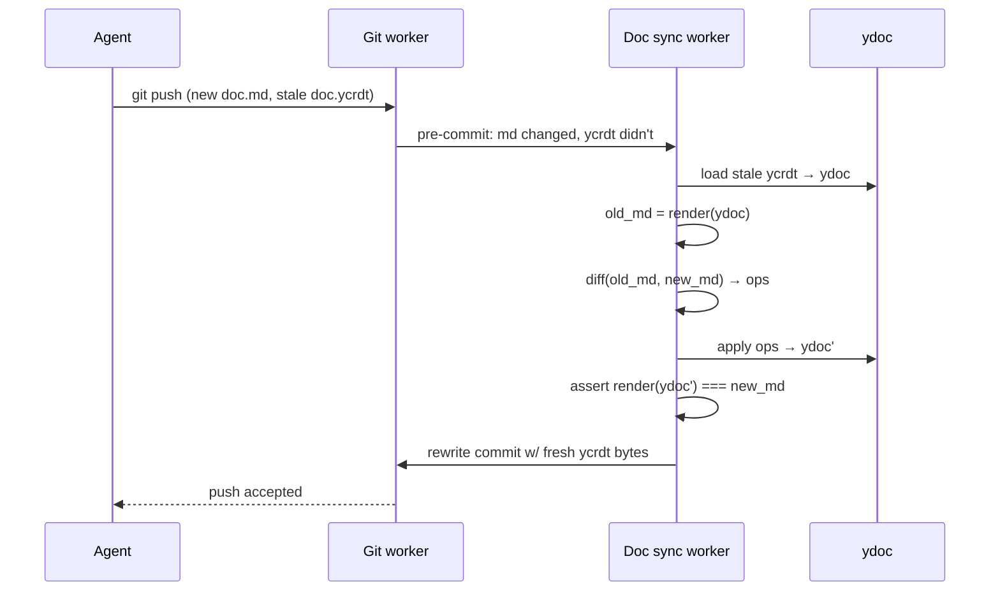

# sheaf — design doc v0.1

*a documentation-first ide for the ai era. storage substrate: cloudflare artifacts (git). editing substrate: yjs crdts. comments: first-class, versioned, cross-cutting. users never see `git merge`.*

> sheaf *(n.)* — algebraic-geometry term for locally-defined data glued into a globally coherent object. apt, bc every workspace is locally authored but the org's knowledge graph is the glued whole.

---

## 1. thesis

docs are the primary artifact of software work; code is a compile target. the tools we use to coordinate on docs treat them as either (a) versioned-but-inert text files in git, or (b) multiplayer-but-ephemeral blobs in notion. neither treats docs as what they actually are: long-lived, forkable, commentable, agent-editable specifications.

sheaf is the substrate for treating them that way.

scope of this doc: storage model + md↔ycrdt sync algorithm + comment anchoring + draft model + mcp surface. out of scope: editor rendering, auth, billing, infra topology beyond what sync requires.

---

## 2. storage model

**one repo per org**, folders per workspace. single ref namespace means cross-cutting proposals are trivially a branch touching multiple folders.

```
.sheaf/
  config.yml              # org-level config
workspaces/
  infra/
    docs/
      proposal.md         # canonical prose + inline RFM review markup
      proposal.ycrdt      # yjs state snapshot (binary)
      adr-012.md
      adr-012.ycrdt
  product/
    docs/
      q3-roadmap.md
      q3-roadmap.ycrdt
```

every doc is self-contained: `<name>.md` (its prose **and** its review state) + `<name>.ycrdt`. there are no `.threads/` sidecars — comments, proposed changes, and threads live inline in the markdown, roughdraft style (see `roughdraft-review-markup.md`): CriticMarkup spans (`{==anchor==}{>>comment<<}{#id}`, `{~~old~>new~~}{#id}`, …) for the anchored comment / change, plus a YAML **endmatter** block (`comments:` / `suggestions:` maps keyed by thread id) that authoritatively stores the thread records homed in that doc.

- `.md` = canonical prose **with** an inline review layer. readers that want clean prose — the editor, what agents grep, the style corpus, what diff viewers render — get a *stripped projection*: the inline markers and endmatter removed. the review layer is read separately by parsing the endmatter.
- `.ycrdt` = yjs state snapshot (binary). **the merge-truth.** source of authority for concurrent-edit semantics.
- a thread's *home* doc is `targets[0].path`; its record lives in that doc's endmatter (created there, or re-homed after a cascade).

**cross-cutting threads** list multiple targets in their record but are stored once, in the home doc's endmatter. resolving "all threads on doc X" scans each doc's endmatter for a target matching X — no separate index file to keep coherent.

**cascade rules:**
- doc renamed → its `.md` (review state and all) moves with it; the target paths recorded inside every doc's endmatter that point at the old path are rewritten in the same commit.
- doc deleted w/ home threads → re-home the records to the next remaining target's doc; no remaining targets → archive. never silently delete.

**invariant 1 (consistency at rest):** at every commit on every branch, `render(doc.ycrdt) === strip(doc.md)` — the ycrdt is the canonical prose; the review layer is the endmatter carried alongside it in the same `.md`.

**invariant 1.5 (thread locality):** every thread record lives in exactly one doc's endmatter — its home doc (`targets[0]`).

---

## 3. invariants

1. **consistency at rest** — render(ycrdt) === strip(md) at every committed state (the clean prose; the inline review layer rides in the doc's endmatter)
2. **crdt merge commutes** — two branches merge via yjs update-merge; result is deterministic regardless of op order
3. **anchor survival** — comment anchors (yjs relative positions) survive any edit to the underlying ytext, provided the ycrdt history is intact
4. **no silent annihilation** — if a ycrdt is reconstructed from md (history lost), anchors fall back to content-based fuzzy matching; orphans surface in ui, never vanish

---

## 4. the md ↔ ycrdt sync algorithm

four cases. three boring, one genuinely hard.

### 4.1 case 1 — crdt edit (web editor)

easy path.

1. user types in web editor → yjs op generated in the doc's Durable Object → applied to in-memory ydoc → broadcast to connected clients via websocket
2. at commit point (user hits "keep draft", or idle-timeout fires): serialize ydoc to bytes → stage `doc.ycrdt`; render ydoc → stage `doc.md`; one git commit, both files

no sync work needed; the two representations are produced atomically from one source.

### 4.2 case 2 — md edit (agent pushes via git)

the interesting path. agent clones a branch via `artifact-fs` or plain `git clone`, edits `doc.md` in whatever tool it wants, doesn't touch `doc.ycrdt`, `git push`.

sheaf's git worker sees: md changed, ycrdt unchanged. cannot accept as-is (invariant 1 broken). must reconcile before the push completes.



algorithm detail:

1. load current `doc.ycrdt` into a fresh ydoc
2. `old_md = render(ydoc)`
3. compute char-level diff(`old_md`, `pushed_md`) — myers, patience, or histogram; v0 uses myers
4. translate each diff hunk into a yjs text op against the ydoc:
   - hunk "delete chars [a, b)" → `ytext.delete(a, b - a)`
   - hunk "insert string s at a" → `ytext.insert(a, s)`
5. apply ops → new ydoc
6. **verify**: `render(new_ydoc) === pushed_md`. if not equal, bail w/ an error surfaced to the pusher; do not accept the commit
7. serialize new ydoc → `doc.ycrdt` bytes. rewrite the commit to include the updated ycrdt alongside the md change. accept push.

why this preserves anchors: yjs relative positions are tuples of (left-origin-op-id, right-origin-op-id) pointing into the ycrdt's internal op graph. inserts and deletes in unchanged regions don't touch the origin-ids that bracket anchors in other regions — anchors stay pinned to the same logical text. anchors inside a deleted hunk are tombstoned (still resolvable) and get resolved via content-fallback on read (§5).

cost: md rendering + diff + op translation on every git push. cheap (<100ms for docs <1mb); runs in a worker. cache state vectors per branch so repeat pushes on the same branch don't re-serialize.

### 4.3 case 3 — concurrent edits across branches

user edits `proposal.md` in the web editor on branch `draft-alice`. in parallel, an agent pushes a refactor to branch `exp-refactor`. user asks to combine them.

both branches have valid `doc.ycrdt` files that share common yjs history at the fork point. merging is a yjs operation, not a git one:

1. load both ycrdts → `ydoc_A`, `ydoc_B`
2. compute the update diff: `update = Y.encodeStateAsUpdate(ydoc_B, Y.encodeStateVector(ydoc_A))`
3. `Y.applyUpdate(ydoc_A, update)` → merged ydoc. commutative, associative, conflict-free by construction
4. render merged ydoc → merged md
5. commit `{merged ycrdt, merged md}` onto target branch

user sees a rendered-markdown diff of merged vs. pre-merge draft. same review ux as a pr. the word "merge" never surfaces; button says **accept** or **combine**.

edge case — concurrent semantic conflict: agent rewrites a paragraph alice simultaneously deleted. crdt merge semantics say both ops apply; alice's delete tombstones the old text, agent's edits land but reference tombstoned content. render produces a consistent-but-weird output. **this is a ui problem, not a correctness problem.** reviewer sees the diff, sees something is off, decides. no conflict markers, no data loss.

### 4.4 case 4 — ycrdt loss / corruption

`doc.ycrdt` deleted, truncated, or fails to deserialize. recovery:

1. rebuild ydoc from `doc.md`: fresh client id, single insert of the full md text. history starts from zero.
2. all existing threads targeting this doc have invalid `rel_pos`. on next read, each falls back to content-anchor resolution (§5).
3. log the event; ui shows "version history reset at <commit>" on the doc's history panel.

this is the worst-case fallback. mitigations:
- pre-commit validation that ycrdt deserializes cleanly before accepting a push
- out-of-band ycrdt snapshot backup (R2, independent of git) so recovery can restore history if available
- periodic integrity audit job that opens every ycrdt on main and flags any that fail

---

## 5. comment anchors: inline markup + content tiers

threads live **inline in the doc markdown** — roughdraft-flavored review markup (see `roughdraft-review-markup.md`), not a sidecar file. a doc's YAML endmatter authoritatively stores every thread record homed in it (`comments:` for plain threads, `suggestions:` for threads carrying a proposed change), keyed by thread id; the inline CriticMarkup spans are a regenerated projection of those records over the prose. threads are first-class entities that *point at* docs; a thread can point at multiple docs (cross-cutting) but its record lives in exactly one doc's endmatter — its home (`targets[0]`; see §2 for cascade rules).

a doc with one range-anchored comment looks like:

```markdown
the proposed api {==should return==}{>>does this account for the rate limit?<<}{#thrd_9fe2} a 429.

---
comments:
  thrd_9fe2:
    by: alice
    at: "2026-04-17T10:23:00.000Z"
    status: open
    created: 1776414180000
    targets:
      - path: workspaces/infra/docs/proposal.md
        scope: range
        anchor:
          rel_pos: <base64 {from,to}>                      # tier 1: exact offsets
          content_hash: <sha256 of ±64 surrounding chars>  # tier 2: fast fuzzy
          anchored_text: "should return"                   # tier 3: slow fuzzy
          context_before: "the proposed api "
          context_after: " a 429."
    messages:
      - author: alice
        ts: 1776414180000
        body: "does this account for the rate limit?"
      - author: bob
        ts: 1776417720000
        body: "yeah see §3.2"
```

**reading.** `readDoc` returns the *stripped projection* — clean prose with the inline markup and endmatter removed. the review layer is read separately by parsing the endmatter into thread records. the inline `{#id}` span gives each anchored thread a position in the prose by construction; `rel_pos` / `content_hash` / `anchored_text` are computed against that clean prose.

**resolution order** (when re-locating an anchor after an edit, e.g. on re-projecting the inline span):

1. try `rel_pos` (the stored clean-prose offsets) — if the slice still equals `anchored_text`, use it. done.
2. otherwise search for `anchored_text` verbatim in the current prose; the nearest occurrence wins. (`content_hash` / context are the fuzzier fallbacks the production backend layers on.)
3. no match → the thread keeps its record in the endmatter but gets no inline span — **orphaned**. surface it in an "unanchored threads" panel; the user re-anchors or archives.

**cross-cutting.** `targets` is a list; a thread can span arbitrary docs across workspaces. it is stored once, in its home doc's endmatter, and listed wherever its targets point. resolving "all threads on doc X" scans each doc's endmatter for a target whose path is X — there is no derived index file to keep coherent across merges (the previous `thread-index.yml` is gone: the source of truth is the docs themselves). this trades an index lookup for a tree walk, which is cheap at v0 scale and removes a whole class of merge-conflict / rebuild machinery.

**strip rules.** the clean projection is careful not to touch prose that merely *contains* CriticMarkup. it strips only complete `{#id}`-terminated marker groups — the exact shape sheaf renders — and only when the doc actually carries a review endmatter, and it never injects (nor strips) markup inside fenced/inline code. so hand-typed CriticMarkup (which has no `{#id}`), a doc that documents the syntax, and any doc with no threads all round-trip byte-for-byte. the only thing that would fool it is hand-typing a full `{==x==}{>>…<<}{#id}` group verbatim in non-code prose — contrived enough to set aside at this stage.

---

## 6. branch / draft model

no autosave. every editing session is implicitly a branch.

- **open doc** → fork current main into `draft-<user>-<doc>-<ts>`. the editor's yjs client connects to a DO keyed on this branch.
- **type freely** → ops go into the branch's live ydoc. no git commits yet; state lives in DO memory + periodic DO-level persistence.
- **end of session** (idle timeout, tab close, explicit "keep") → prompt **keep / discard / propose**:
  - *keep*: commit to branch; branch lives in user's drafts panel
  - *discard*: nuke branch
  - *propose*: open rendered-md diff vs. main; single button to accept
- **agent experiments** → identical. `fork(doc, n)` creates n draft branches, each with its own DO + ydoc seeded from main. agents work in parallel. user reviews n diffs, keeps zero/some/all.

user-facing vocabulary: **drafts**, **versions**. never "branch." never "merge." the word on the button is **accept**.

cross-cutting: a draft branch can span workspaces. the diff view shows all files touched, grouped by workspace, with per-file rendered-md diffs. one accept button commits the whole set.

---

## 7. mcp surface

md-shaped, not block-shaped. this is the anti-notion design choice. agents deal in paths and strings, not block ids.

```
list_workspaces() -> [{name, path}]
list_docs(workspace, prefix?) -> [{path, title, updated_at, head}]
read_doc(path, ref?="main") -> {md, ycrdt_version, head_commit}
list_threads(path?|thread_id?) -> [thread]
propose(path, new_md, note?, draft_name?) -> {draft_id, diff_url}
fork(path, n, seed_prompt?) -> [draft_id]
merge(draft_id) -> {ok, commit}      # usually human-gated; exposed for automation
add_thread(targets[], anchor, message) -> thread_id
reply_thread(thread_id, message) -> ok
resolve_thread(thread_id) -> ok
```

notes:
- `propose` invokes the case-2 sync algorithm internally. agent just passes new md; sheaf derives ycrdt ops and commits the pair.
- `fork` is the killer primitive for "try 3 refactors." returns n draft ids; each can be developed in parallel, reviewed separately, merged independently.
- `add_thread` accepts simple anchors (`{path, char_range}`) and fills in `rel_pos` + `content_hash` server-side from current doc state.
- all write ops are idempotent given a client-supplied `op_id`. retries are safe.

**three-surface access pattern:**

1. **in-app agent sidebar** — 90% case. non-technical users. never sees the mcp, never sees git. just "refactor this section" → diff appears → click accept.
2. **mcp server** — power users with claude code / claude.ai. tool-native access to the above api.
3. **ambient integrations** — email-reply-to-propose, slack `@doc`, browser extension for highlight→rewrite. thin wrappers over the mcp.

all three talk to the same branch+merge substrate. no separate codepaths, no separate conflict models.

---

## 8. v0 cuts, v1 aspirations

**v0 ships:**

- plain `Y.Text` (single string per doc). markdown syntax lives literally in the text. editor renders live-preview á la obsidian / iA writer
- one ycrdt per doc
- char-level myers diff for case-2 reconciliation
- in-app editor, mcp server, review/diff ui, two-tier comment anchors
- draft branches with keep/discard/propose terminal states

**v0 punts:**

- **prosemirror/tiptap schema-aware crdt.** rich structural formatting (tables, embeds, nested lists) gets better semantics in v1. v0 accepts "bold renders as `**bold**` in source view."
- **semantic diff.** v0 treats paragraph moves as delete+insert; anchors in moved blocks fall back to content anchors. v1 considers block-move detection.
- **image/media handling.** v0: external blob store (r2), `` refs in md. v1: lfs-ish escape hatch with sheaf-native apis.
- **ycrdt history compaction.** v0 lets history grow. monitor; compact when a single ycrdt exceeds ~1mb.
- **cross-workspace search.** v0 = path + fuzzy filename. v1 = workers + vectorize.
- **per-doc acl.** v0 = repo-scoped tokens from artifacts. v1 = doc-level permissions layer.

---

## 9. open questions

- **commit cadence on drafts**: idle-timeout feels right but wants user testing. probably adaptive — frequent during active typing, sparse otherwise. what are good defaults?
- **artifact-fs cold-mount latency** for agent sandboxes at p95 — benchmark before betting the agent ux on it. fallback is `git clone --depth=1` which is likely fine for <100mb repos.
- **merge-render edge cases** (case 3's "delete + concurrent edit"): needs a ui design for "this section was deleted in one draft and edited in another — keep, drop, or restore both?" afaict this is more common than it sounds.
- **state-vector bloat** on long-lived docs: when to snapshot? how to coordinate snapshots across live drafts (a snapshot rewrites op ids, invalidating every draft's rel_pos anchors)?
- **multi-agent collaboration on one draft** — crdt says yes, ux says idk. probably each agent gets its own fork by default; explicit opt-in for shared drafts.
- **offline editing** — the DO is the canonical multiplayer surface, so pure-offline is out of scope for v0. clients can buffer ops and replay on reconnect. "really offline" is a v2 conversation.
- **partial-merge of cross-cutting threads** — if a thread targets `a.md` (on main) and `b.md` (draft-only), and only the `a.md` changes merge (cherry-pick, or manual git surgery), the thread lands on main referencing a nonexistent `b.md`. handling: targets with missing paths get `status: missing` at **read** time; ui surfaces "drop target / re-anchor elsewhere." general invariant — *any path ref in `thread.targets` is validated at read time against the current ref*, never at write time. cross-branch reads of threads also surface this gracefully.
- **cross-doc scan cost at scale** — "all threads on doc X" now scans every doc's endmatter rather than reading a derived index. fine at 10k docs, meh at 100k, slow approaching 1m. mitigations in order of effort: (a) a cheap per-workspace cache of `{doc → has-endmatter}` to skip clean docs, (b) reintroduce a rebuildable derived index *only* for cross-cutting (multi-target) threads, (c) offload to a DO with kv backing. defer until actual pain. note this trades the old `thread-index.yml` merge-conflict/rebuild machinery for a stateless walk.
- **orphan-target detection on merge** — invariant 1.5 says every thread record lives in its home doc's endmatter. a record may list a target whose doc doesn't exist on the merged branch; per the "partial-merge" note above, any path in `thread.targets` is validated at **read** time and surfaced as `status: missing`, never silently dropped. worth an explicit test.

---

## appendix a: why not just use git for everything

git's merge operates on text. two people editing adjacent paragraphs = merge conflict in raw git, resolved by hand. crdts solve this by construction. the ycrdt layer exists specifically to eliminate the merge-conflict ux from the human's workflow. git remains the versioning spine, blame/bisect/fork substrate, and agent interop layer — but it is not the merge engine.

## appendix b: why not just use yjs and skip git

yjs gives you merge; it does not give you named history, cryptographic provenance, third-party tool interop, cheap forking, or a well-understood access model. and every existing agent tool (claude code, aider, codex, copilot workspace) speaks git natively. the artifacts substrate lets us have both without writing a new sync protocol.

the two-layer design is load-bearing: **crdts for merges, git for history.** everything else follows from that decision.
